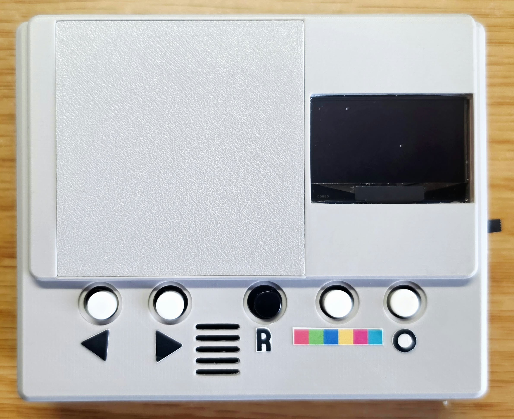
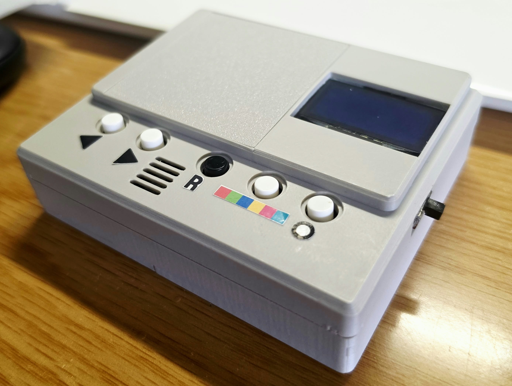
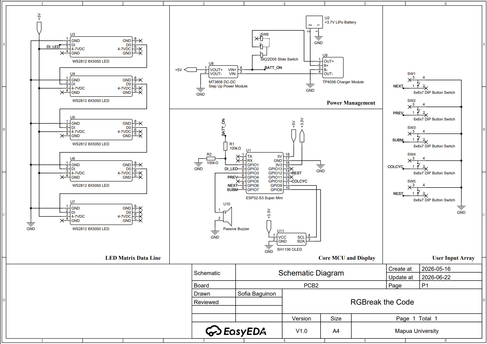
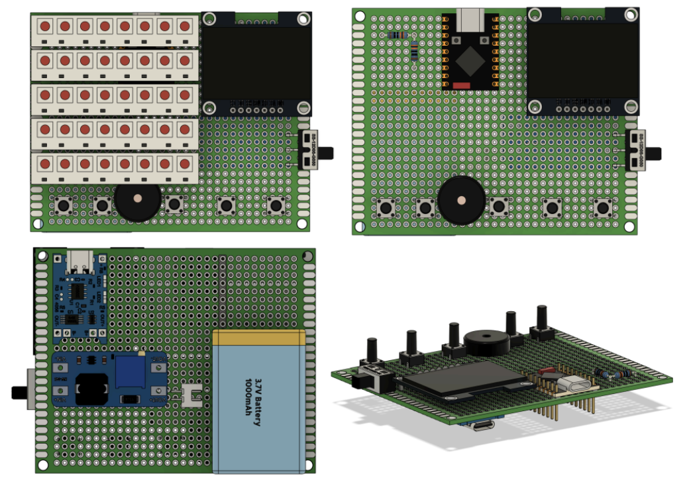
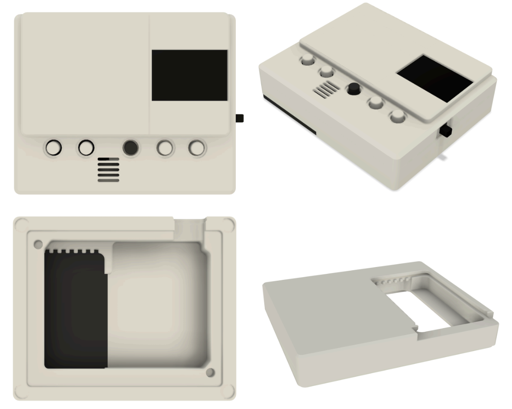

# RGBreak the Code

A handheld embedded logic puzzle built around the ESP32-S3.

RGBreak the Code is a standalone physical code-breaking game that uses tactile controls, an OLED display, and an RGB LED matrix to provide immediate visual and auditory feedback.

  
  

[▶ Watch the RGBreak the Code Demo](https://drive.google.com/file/d/17QTlvfeYh7tGejYH-UeQBKx7vbnn-pax/view?usp=sharing)

## Features

- ESP32-S3 based standalone embedded system
- Four-color code-breaking gameplay
- Multiple secret-code generation modes
- Configurable number of attempts
- Optional countdown timer
- Tactile push-button controls
- SH1106 OLED interface
- WS2812 RGB LED matrix
- Exact and partial match feedback
- Passive buzzer for audio feedback
- Rechargeable LiPo power system
- Battery-level monitoring
- Custom 3D-printed enclosure
- Fully offline operation

## Hardware

- ESP32-S3 Super Mini
- SH1106 OLED display
- WS2812 addressable RGB LEDs
- Five tactile push buttons
- Passive piezoelectric buzzer
- 803860 3.7 V LiPo battery
- TP4056 charging module
- MT3608 boost converter
- Custom 3D-printed enclosure

## Software and Tools

- C++
- PlatformIO
- Visual Studio Code
- EasyEDA Pro
- Autodesk Fusion 360

## Design Overview

### Schematic Diagram

### PCB Layout

### Enclosure Design

## Documentation

For operating instructions, gameplay, troubleshooting, and hardware specifications:

[View the RGBreak the Code User Manual](docs/RGBreak-the-Code-Manual.pdf)

## Status

Functional prototype completed and tested.
